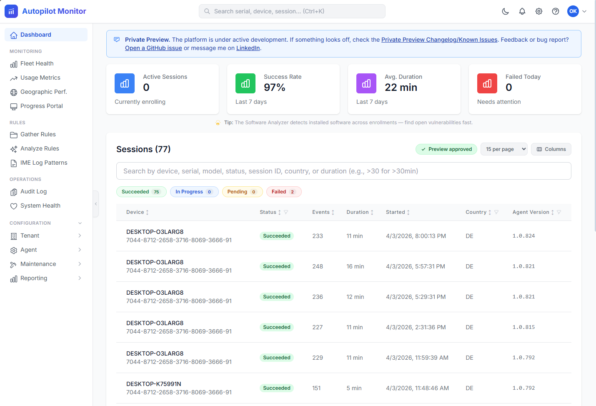
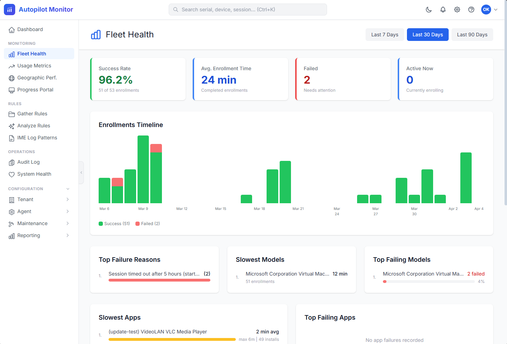
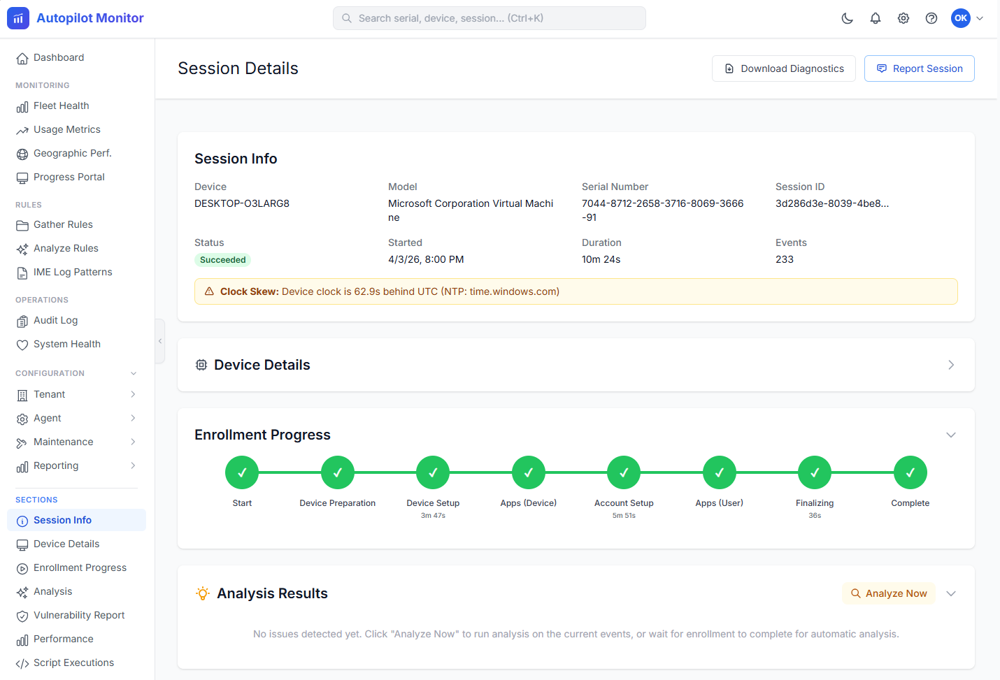
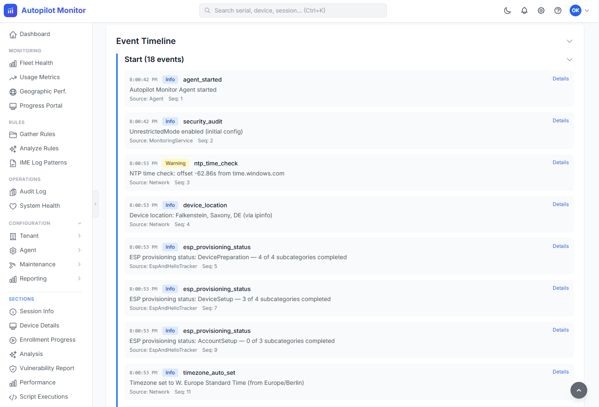

# Autopilot Monitor

Advanced monitoring and troubleshooting solution for Windows Autopilot deployments.

## Private Preview

Autopilot Monitor is currently running as a **Private Preview**. Visit **[autopilotmonitor.com](https://www.autopilotmonitor.com)** to request access and learn more.

  
  

  
  

## Overview

Autopilot Monitor provides real-time tracking, intelligent diagnostics, and automated troubleshooting for Windows Autopilot enrollment processes. It consists of:

- **Bootstrap Script** — PowerShell script deployed via Intune that starts monitoring early in the enrollment process
- **Monitoring Agent** — Lightweight .NET application that collects telemetry and evidence during enrollment
- **Backend API** — Azure Functions-based ingestion and processing pipeline
- **Web Dashboard** — Next.js application for real-time monitoring and fleet analytics

## Architecture

For detailed information about the system architecture, components, and data flow, see [Architecture Documentation](docs/architecture.md).

## Documentation

Full documentation is available at **[autopilotmonitor.com/docs](https://www.autopilotmonitor.com/docs)**

## License

This project uses a **split licensing model**:

- **MIT License** — Agent (`src/Agent/`) and Shared library (`src/Shared/`) — unrestricted use on end-user devices
- **AGPL-3.0** — Backend (`src/Backend/`), Web Dashboard (`src/Web/`), and MCP Server (`src/McpServer/`) — server-side components remain open source

See [LICENSE](LICENSE) for full details.
